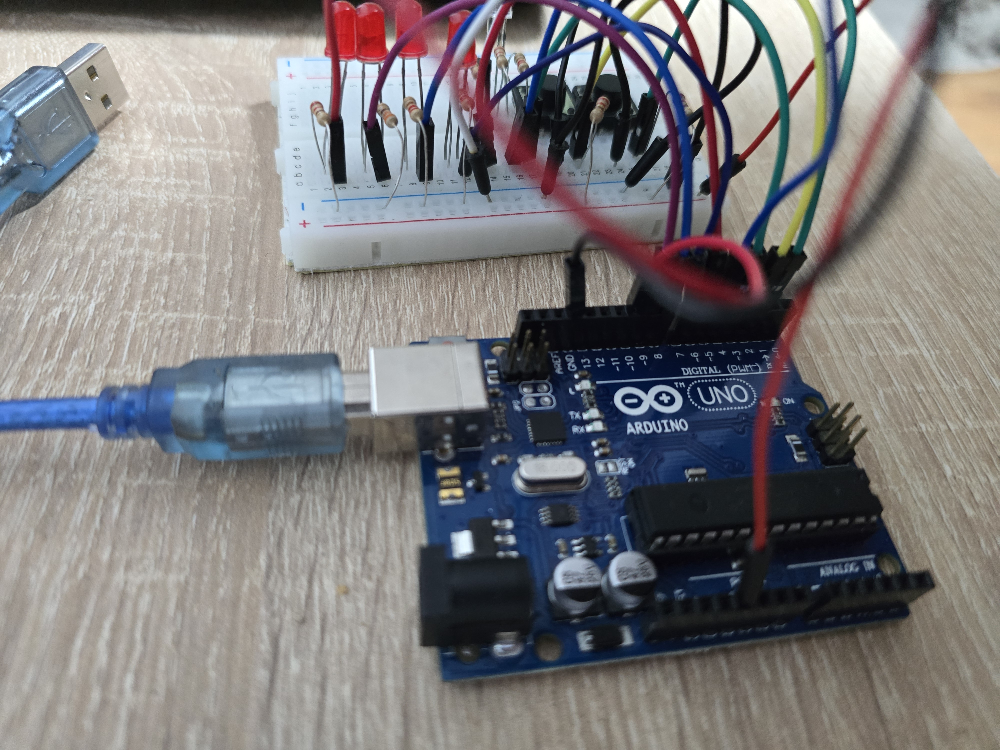
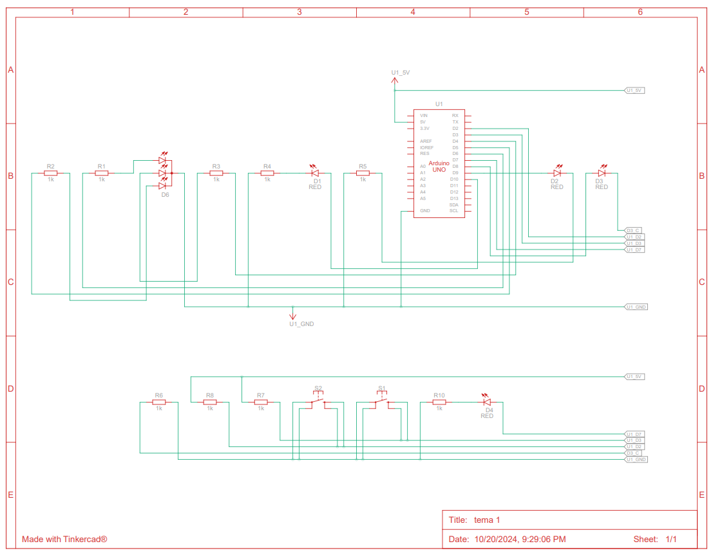

# Descrierea task-ului
În această temă trebuie să simulați o stație de încărcare pentru un vehicul electric, folosind mai multe LED-uri și butoane. 
În cadrul acestui task trebuie să țineți cont de stările butonului și să folosiți debouncing, dar și să coordonați toate componentele ca într-un scenariu din viața reală.

## Componente utilizate

- 4x LED-uri (pentru a simula procentul de încărcare)
- 1x LED RGB (pentru starea de liber sau ocupat)
- 2x Butoane (pentru start încărcare și stop încărcare)
- 8x Rezistoare (6x 220/330ohm, 2x 1K)
- Breadboard
- Linii de legătură

## Montaj fizic

## Schema electrică

Video cu funcționalitatea montajului https://youtu.be/3ECKKEyxzsw